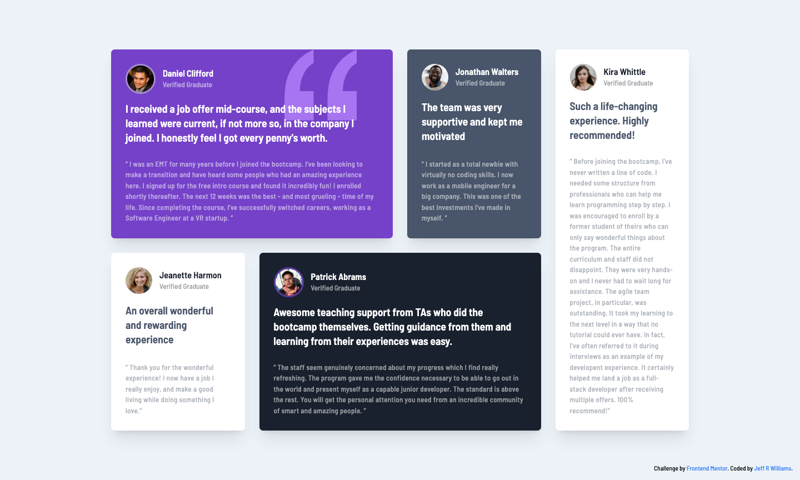
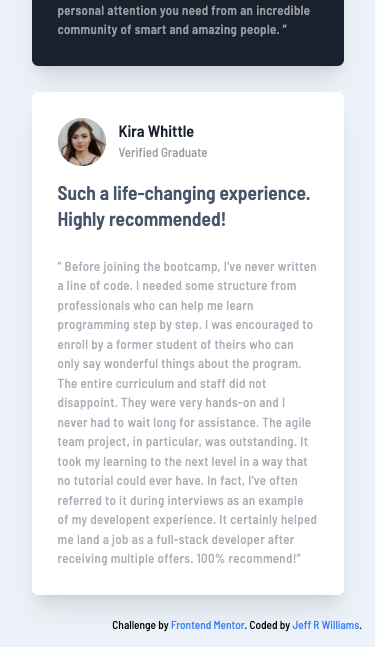

# Frontend Mentor - Testimonials grid section solution

This is a solution to the [Testimonials grid section challenge on Frontend Mentor](https://www.frontendmentor.io/challenges/testimonials-grid-section-Nnw6J7Un7). Frontend Mentor challenges help you improve your coding skills by building realistic projects.

## Table of contents

- [The challenge](#the-challenge)
- [Screenshots](#screenshot)
- [Links](#links)
- [Built with](#built-with)
- [Author](#author)

## The challenge

Users should be able to:

- View the optimal layout for the site depending on their device's screen size

## Screenshots

## Links

- Solution URL: [GitHub Repo](https://github.com/orphandeity/testimonials-grid-section.git)
- Live Site URL: [GitHub Pages](https://orphandeity.github.io/testimonials-grid-section)

## Built with

- [Svelte](https://svelte.dev/) - Frontend framework
- [Vite.js](https://vitejs.dev/) - Frontend Tooling
- [TailwindCSS](https://tailwindcss.com/) - For styles

## Author

- Frontend Mentor - [@orphandeity](https://www.frontendmentor.io/profile/orphandeity)
